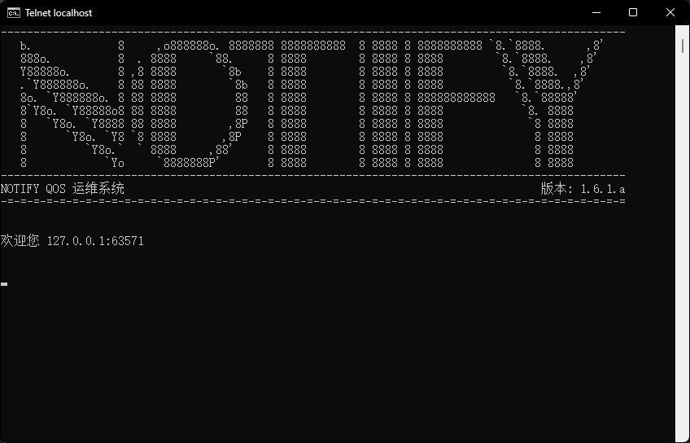
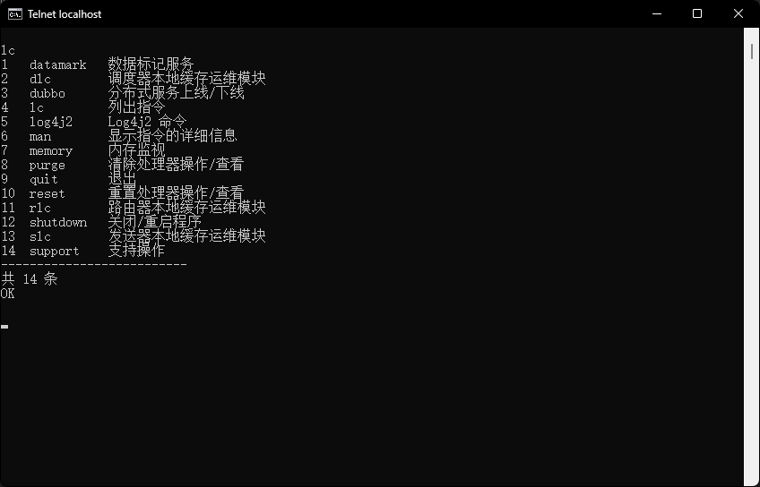

# notify

Notify 是一个功能全面的通知服务，旨在为用户提供高效、可靠的通知体验。

---

## 特性

- 以 SPI 的形式对通知流程进行标准化，如主题（Topic）、调度（Dispatch）、路由（Route）等。
- 提供 Telqos 运维平台，能够在没有 GUI 的环境下使用本服务的功能。
- 支持主流关系型数据库（基于 Hibernate）。
- 支持分布式部署。

## 文档

该项目的文档位于 [docs](../../../docs) 目录下，包括：

### wiki

wiki 为项目的开发人员为本项目编写的详细文档，包含不同语言的版本，主要入口为：

1. [简介](./Introduction.md) - 即本文件。
2. [目录](./Contents.md) - 文档目录。

## 运行截图

Telnet 运维平台 banner：

Telnet 运维平台指令合集：

